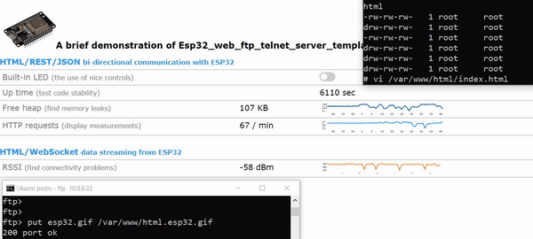
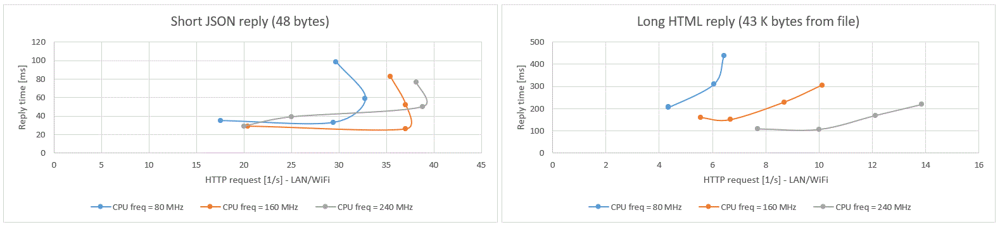
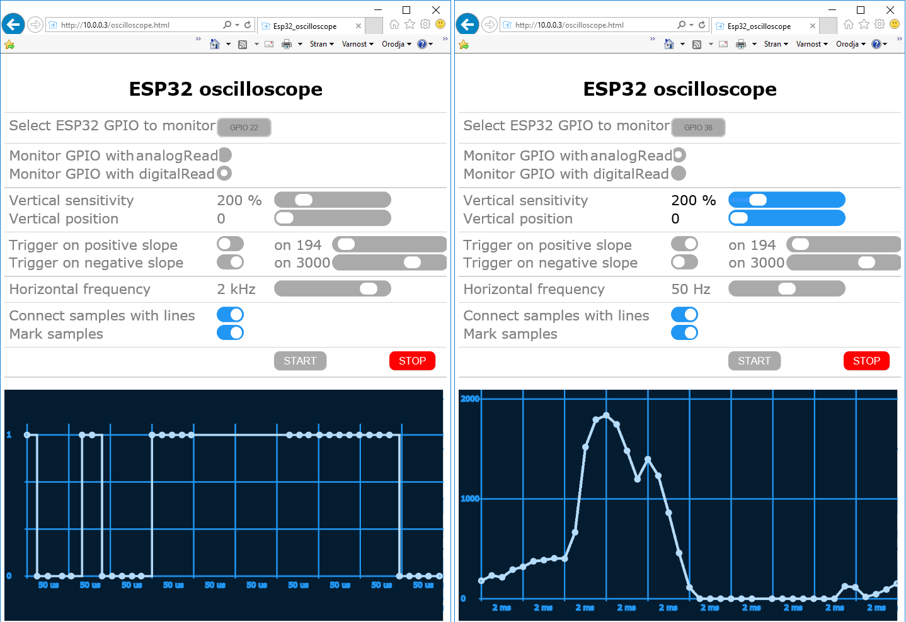

# ESP32 based battery charge measurement

### This project is for monitoring battery charge state [Ah] in sailing boat

ADC measurement sample rate has choosen to be 50 ms for reason tiller pilot operation.
Tiller pilot motor drives very short periods (typically one to two secons at time).
Sample rate may be need to change shorter. INA219 chip will software configure to
do 16 ADC convesions averaging by silicon which takes about 8.5 ms.
INA219 chip sensitivity is 10 uV / bit (12 bit conversion).
Other alternative common used module type INA226 have sensitivity 2.5 uV / bit
(16 bit conversion).
Battery charging calculation expects efficiency by default to be 80% (software feature)

Used components are
- Seeed Studio XIAO ESP32-S3 module (dual core CPU)
  - https://wiki.seeedstudio.com/xiao_esp32s3_getting_started/
- Adafruit INA219 Featherwing
  - https://eu.mouser.com/new/adafruit/adafruit-ina219-development-kit/
  - https://learn.adafruit.com/adafruit-ina219-current-sensor-breakout/overview

Web page references
- https://github.com/BojanJurca/Multitasking-Esp32-HTTP-FTP-Telnet-servers-for-Arduino
- https://github.com/RobTillaart/INA226
- https://github.com/adafruit/Adafruit_INA219
- https://github.com/adafruit/Adafruit-INA219-Current-Sensor-PCB
- https://platformio.org
- https://joy-it.net/en/products/SBC-NodeMCU-ESP32  (first software tests with telnet + ADC)

Project based "multi purpouse" server application template (GitHub) project referenced above and described later in this document 
(*Multitasking-Esp32-HTTP-FTP-Telnet-servers-for-Arduino*).
Original project have been bug fixed, modified and added several software modules and features.

Project is ported with minimal effort from Arduino IDE environment to 
more "professional" Visual Studio Code + PlatformIO plugin development environment.
PlatformIO source files resides different folder structure as
Arduino IDE project files. PlatformIO active sources are in sub directory tree "src".

New software modules and configuration files
- *adcmeasure.cpp / .h* - fixed separated ADC measurement functions for telnet commands (support NodeMCU ESP32 JoyIT and SeeeD Studio XIAO ESP32-S3)
- *measure.cpp / .h* - current measurement task, which use INA219 measurement chip (I2C bus device)
- *ina219.cpp / .h* - Aduino project style driver code module to access measurement chip
- *ina226.cpp / .h* - Aduino project style driver code module to access measurement chip
- *util.cpp / .h* - contain telnet server's command extensions executable code(s)
- *ina219.pdf* - data sheet of measuremen chip
- *ina226.pdf* - data sheet of measuremen chip (recommended for new desig)
- *FL2C100.pdf* - data sheet of current measurement shunt resistor
- *plaformio.ini* - PlatformIO project configuration file
- *partitions_ESP32_\*.csv* - flash memory partitioning configuration files used by platformIO build process (referenced in platformio.ini file)

New telnet commands
- *adc [gpio]* - where "gpio" is gpio pin number
- *ina* - reset INA219 chip and set continuous 16 A/D samples averaging mode (takes about 8.5 ms to make 16 A/D conversions by hardware)
- *ina [reg]* - read INDA219 register
- *ina [reg] [data]* - write "data" to INA219 chip register "reg". Data value can be 10 or 16 based (0x.. prefix)
- *charge* - print voltage [V],  current value [A], current charged/discharged in [As] and [Ah]
- *charge [stat]* - print measure task's self measuremnt debug statistics of task's timings [ms] and [10*ms]
- *export* - export measurement history data file (little endian binary format - struct dataset_t)
- *fwupdate* - firmware boot code update to flash chip from file system "/firmware.bin" (use FTP to upload file)

Other significant things
- WinSCP's FTP feel to operate well with ESP32 application
- PuTTY feel to operate well with ESP32 application
- BeyondCompare's FTP do not work with ESP32 application
- Sourcetree is good alternative to GitHub Desktop application (ofcource there are many other good alternatives)
- Measurement sample rate jitter for charge state measurement is enough good
  (verified using 10 ms sample rate, use telnet command "charge stat" - results requre some interpret by user!)
- Oscilloscope web page and code have new ADC gain selection "ATTEN"
- Change oscilloscope's horizontal speed selection units as ordinary scope(s) use time/div
- Oscilloscope's sample rate using two core ESP32S3 running 240 MHz is quite poor with higher horizontal speeds
  - 17 samples / 50 us digital input,
  - 7 samples / 200 us analog free run, analog sampling may have 200 us gaps in middle of measurement data !!!!
- Alternative oscilloscope software platform: ESP32S3 processor contain also Ultra-low-power RISC-V (RV32IMC)
  coprocessor clocked at 17.5 MHz approximately (https://en.wikipedia.org/wiki/RISC-V).
  - Probably ADC sampling can do faster and with more accurate sample rate using this RISC coprocessor core.
- NOTE: ESP32's ADC conversion is quite non linear (see CPU specs) and might require some kind linearization lookup table system.
- Lets make independent oscilloscope project and do not try to include into this project.
- Original code missing ADC initialization / configuration at all (initialization added to oscilloscope code)
- Commenting WiFi configuration options more reader covinient and add optional feature to clear WiFi configuration files from flash file system at boot time (when user make wrong configuration and do not get WiFi connection to target device) 
- A lot of other things (compare for example repository's current state to commit ".gitignore" very begin of commit history). IntelliJ IDEA or PyCharm community versions have good visual git tools to compare commits. Also some Visual Studio Code plugins offer same features.

### ESP32S3 Recovery from bad program
Sometimes developer make bad program which loops for ever reset and program die (this is really easy common mistake).
ESP32S3 do not have real externa USB serial port chip which handles physically EN (reset) and BOOT mode pins (like)
ESP32nodeMCU board does! Here USB serial port is only piece of boot program of ESP32S3 CPU.

Recovery sequence is explained here
- https://wiki.seeedstudio.com/noport_upload_fails/#for-xiao-esp32s3-sense
There are two minimal buttons on Seeed Studio's XIAO ESP32S3.
- EN (reset button)
- BOOT mode selector (same as button on GPIO0 - suggest to use external larger button on own board)
Use following sequence to recover from bad application:
- Press and hold the BOOT key while powering up (continue keeping boot button pressed)
- Then press the Reset key once (you can enter BootLoader mode).
- Release BOOT key (you are now on boot loader mode !!!)
- Upload known well behave application program 

### NOTE: Little FS !!!!!!!!!
*LittleFS keeps file writes in a buffer until the file is explicitly flushed or closed. This behavior is intentional and designed to optimize performance by reducing the number of write operations to the underlying storage, which can be slow and wear-sensitive (e.g., in flash memory).*

##### Key Points:

Buffered Writes: When you write data to a file in LittleFS, the data is stored in a memory buffer rather than being immediately written to the storage device.

Flush or Close: To ensure the data is physically written to the storage, you need to either:

- Call lfs_file_sync() (flushes the buffer to storage).
- Close the file using lfs_file_close() (automatically flushes the buffer).

Why Buffering?: This approach minimizes the number of write operations, which is crucial for flash memory as it has limited write/erase cycles.

Potential Risks: If the system crashes or loses power before a flush or close operation, any data in the buffer will be lost. To mitigate this, you can flush the buffer more frequently if data integrity is critical.

This behavior is common in many file systems to balance performance and storage longevity.

##### This means for application program
- Application crash or write at least corrupted data to flash if there is not enough free (conventional)
  heap buffer space available
   

### ToDo
- (Better) web interface to access current measurement data in boat (WiFi Access Point)
- Install in boat and calibrate measurement (use new current sense shunt resistor, see PDF data) - done
- Change sample rate to 10 ms (100 Hz) - done
- Add PSRAM to collect larger "raw mA" or voltage measurement data
- Data measurement burst(s) for osciloscope type visual graphic current vs time view (with higher samplerate) to see
  for example voltage drop of starter battery during engine start
- Save charge measurement data burst(s) to file system for later analysis (FTP transfer to PC for post analysis) - partially done
- Single shot / free run selection to oscilloscope
- Graphical web page of charge history
- Add analyzing heuristics to compute cumulative current consumption of different devices like: navigation electronics, refigerator, tiller pilot, heater (Ebersprecher), etc...

### Alternatives
- There are some interesting commercial products from Victron Energy
- These devices can buy from ClassOhlson, Marineakauppa, Marinea, etc...
- Smart shun is about 90e (300A version), BMV-712 (500A) is 170e ... 250e, BMV-700 (500A) is 125e ... 170e
- Warning: BMV-700 do not contain internal Bluetooth (buy BT or RS232 adapter
  make extra costs and result is near BMV-712 price)
- https://www.victronenergy.com/upload/documents/Datasheet-SmartShunt-IP65-EN-.pdf
- https://www.victronenergy.com/upload/documents/Datasheet-BMV-712-Smart-EN.pdf
- https://www.victronenergy.com/upload/documents/Datasheet-BMV-700-series-EN.pdf
- All these devices have interesting 4 pin serial port connector for hobbyist
- Even these devices offers serial port communication to collect measurement data,
  communication and measurement sample ratio is slow and do not offer possibility to make oscilloscope style measurements of following cases
  - voltage drop vs time at starting event (for example one sample per ms, feature ToDo...)
  - exact current consumpion of tiller pilot durin active ("servo motor") motion drive, where motor drives typically
    one or two second (feature ToDo...)
- https://www.victronenergy.com/live/open_source:start
- https://www.victronenergy.fi/battery-monitors/smart-battery-shunt#downloads-technical-information
- https://www.victronenergy.com/upload/documents/VE.Direct-Protocol-3.34.pdf
- https://www.victronenergy.com/upload/documents/BMV-7xx-HEX-Protocol.pdf (also SmartShunt)
- https://www.victronenergy.com/upload/documents/Technical-Information-Data-communication-with-Victron-Energy-products_EN.pdf
- https://www.victronenergy.com/media/pg/BMV-700/en/installation.html

Rest of this README is original template projec's README (for additional info)

# =================================

## ESP32 with HTTP server, Telnet server, file system, FTP server FTP client, SMTP client, cron daemon and user management.

### This template is a quick and easy way to build a nice user interface for an ESP32 project, without having to take care of all the switches, LED diodes, displays, etc.

   - You only have to modify the telnetCommandHandlerCallback function to build the Telnet user interface for your project.

   - You only have to modify the httpRequestHandler function to build the WEB user interface for your project. If you want a nice stylish look and feel there is also a FTP server built into the template so you can upload larger HTML files.

   - Dmesg message logging is built-in which can help you see what is going on at run-time and debug your project (accessible through Telnet server).

   - A Web-based Oscilloscope is already built-in which can help you see the signals on your Esp32 pins at run-time (accessible through Http server).

Demo ESP32 server is available at [http://jurca.dyn.ts.si](http://jurca.dyn.ts.si)


## The latest changes


The latest changes are support (this applies to built-in oscilloscope) for ESP32-S2, ESP32-S3 and ESP32-C3 boards (most of ESP32 boards should also just work).




## Fully multitasking HTTP server


HTTP server can handle HTTP requests in two different ways. As a programmed response to (for example REST) requests or by sending .html files from /var/www/html directory. Cookies and WebSockets are also supported to certain extent. Demo HTTP server is available at 193.77.159.208.

**HTTP server performance** 




## Fully multitasking Telnet server


Telnet server can, similarly to HTTP server, handle commands in two different ways. As a programmed response to some commands or it can execute already built-in commands (like ls, ping, ...). There is also a very basic text-editor built in, mainly for editing small configuration files. Demo Telnet server is available at 193.77.159.208 (login as root with default password rootpassword).


## Fully multitasking FTP server


FTP server is needed for uploading configuration files, .html files, ... to ESP32 file system. Both active and passive modes are supported.


## Time zones


All the time zones form https://github.com/nayarsystems/posix_tz_db/blob/master/zones.csv can be used.


## Simple key-value database


A simple key-value database is included for the purpose of managing (keeping) web session tokens. Other key-value databases can easily be added using the same technology, for different purposes (such as statistics of visited pages, etc). 


## Configuration files


```C++
/usr/share/zoneinfo                       - contains (POSIX) timezone information
/etc/passwd                               - contains users' accounts information
/etc/shadow                               - contains hashed users' passwords
/network/interfaces                       - contains WiFi STA(tion) configuration
/etc/wpa_supplicant/wpa_supplicant.conf   - contains WiFi STA(tion) credentials
/etc/dhcpcd.conf                          - contains WiFi A(ccess) P(oint) configuration
/etc/hostapd/hostapd.conf                 - contains WiFi A(ccess) P(oint) credentials
/etc/ntp.conf                             - contains NTP time servers names
/etc/crontab                              - contains scheduled tasks
/etc/mail/sendmail.cf                     - contains sendMail default settings
/etc/ftp/ftpclient.cf                     - contains ftpPut and ftpGet default settings
```


## Setup instructions


1. Copy all files in this package into Esp32_web_ftp_telnet_server_template directory.
2. Open Esp32_web_ftp_telnet_server_template.ino with Arduino IDE.
3. modify (some or all) the default #definitions in Esp32_servers_config.h file (that will be later written to configuration files) **before** the sketch is run for the first time:

```C++
// include version_of_servers.h to include version information
#include "./servers/version_of_servers.h"
// include dmesg_functions.h which is useful for run-time debugging - for dmesg telnet command
#include "./servers/dmesg_functions.h"


// 1. TIME:    #define which time settings, wil be used with time_functions.h - will be included later
    // define which 3 NTP servers will be called to get current GMT (time) from
    // this information will be written into /etc/ntp.conf file if file_system.h will be included
    #define DEFAULT_NTP_SERVER_1                      "1.si.pool.ntp.org"   // <- replace with your information
    #define DEFAULT_NTP_SERVER_2                      "2.si.pool.ntp.org"   // <- replace with your information
    #define DEFAULT_NTP_SERVER_3                      "3.si.pool.ntp.org"   // <- replace with your information
    // define time zone to calculate local time from GMT
    #define TZ                                        "CET-1CEST,M3.5.0,M10.5.0/3" // or select another (POSIX) time zones: https://github.com/nayarsystems/posix_tz_db/blob/master/zones.csv


// 2. FILE SYSTEM:     #define which file system you want to use 
    // the file system must correspond to Tools | Partition scheme setting: FAT for FAT partition scheme, LittleFS for SPIFFS partition scheme)
    #define FILE_SYSTEM    FILE_SYSTEM_LITTLEFS // or FILE_SYSTEM_FAT


// 3. NETWORK:     #define how ESP32 will use the network
    // STA(tion)
    // #define how ESP32 will connecto to WiFi router
    // this information will be written into /etc/wpa_supplicant/wpa_supplicant.conf file if file_system.h will be included
    // if these #definitions are missing STAtion will not be set up
    #define DEFAULT_STA_SSID                          "YOUR_STA_SSID"       // <- replace with your information
    #define DEFAULT_STA_PASSWORD                      "YOUR_STA_PASSWORD"   // <- replace with your information
    // the use of DHCP or static IP address wil be set in /network/interfaces if file_system.h will be included, the following is information needed for static IP configuration
    // if these #definitions are missing DHCP will be assumed
    // #define DEFAULT_STA_IP                            "10.18.1.200"      // <- replace with your information
    // #define DEFAULT_STA_SUBNET_MASK                   "255.255.255.0"    // <- replace with your information
    // #define DEFAULT_STA_GATEWAY                       "10.18.1.1"        // <- replace with your information
    // #define DEFAULT_STA_DNS_1                         "193.189.160.13"   // <- replace with your information
    // #define DEFAULT_STA_DNS_2                         "193.189.160.23"   // <- replace with your information

    // A(ccess) P(oint)
    // #define how ESP32 will set up its access point
    // this information will be writte into /etc/dhcpcd.conf and /etc/hostapd/hostapd.conf files if file_system.h will be included
    // if these #definitions are missing Access Point will not be set up
    // #define DEFAULT_AP_SSID                           HOSTNAME           // <- replace with your information,
    // #define DEFAULT_AP_PASSWORD                       "YOUR_AP_PASSWORD" // <- replace with your information, at least 8 characters
    // #define DEFAULT_AP_IP                             "192.168.0.1"      // <- replace with your information
    // #define DEFAULT_AP_SUBNET_MASK                    "255.255.255.0"    // <- replace with your information

    // define the name Esp32 will use as its host name 
    #define HOSTNAME                                   "MyEsp32Server"      // <- replace with your information,  max 32 bytes
    #define MACHINETYPE                                "ESP32 Dev Module"   // <- replace with your information, machine type, it is only used in uname telnet command


// 4. USERS:     #define what kind of user management you want before #including user_management.h
    #define USER_MANAGEMENT                           UNIX_LIKE_USER_MANAGEMENT // or HARDCODED_USER_MANAGEMENT or NO_USER_MANAGEMENT
    // if UNIX_LIKE_USER_MANAGEMENT is selected you must also include file_system.h to be able to use /etc/passwd and /etc/shadow files
    #define DEFAULT_ROOT_PASSWORD                     "rootpassword"        // <- replace with your information if UNIX_LIKE_USER_MANAGEMENT or HARDCODED_USER_MANAGEMENT are used
    #define DEFAULT_WEBADMIN_PASSWORD                 "webadminpassword"    // <- replace with your information if UNIX_LIKE_USER_MANAGEMENT is used
    #define DEFAULT_USER_PASSWORD                     "changeimmediatelly"  // <- replace with your information if UNIX_LIKE_USER_MANAGEMENT is used


// #include (or comment-out) the functionalities you want (or don't want) to use
#include "./servers/fileSystem.hpp"
#include "./servers/time_functions.h"               // file_system.h is needed prior to #including time_functions.h if you want to store the default parameters
#include "./servers/network.h"                      // file_system.h is needed prior to #including network.h if you want to store the default parameters
#include "./servers/httpClient.h"
#include "./servers/ftpClient.h"                    // file_system.h is needed prior to #including ftpClient.h if you want to store the default parameters
#include "./servers/smtpClient.h"                   // file_system.h is needed prior to #including smtpClient.h if you want to store the default parameters
#include "./servers/userManagement.hpp"             // file_system.h is needed prior to #including userManagement.hpp in case of UNIX_LIKE_USER_MANAGEMENT
#include "./servers/telnetServer.hpp"               // needs almost all the above files for whole functionality, but can also work without them
#include "./servers/ftpServer.hpp"                  // file_system.h is also necessary to use ftpServer.h
#include "./servers/httpServer.hpp"                 // file_system.h is needed prior to #including httpServer.h if you want server also to serve .html and other files
```

4. Select one of SPIFFS partition schemas (Tool | Partition Scheme).

5. Compile the sketch and run it on your ESP32. Doing this the following will happen:

   - ESP32 flash memory will be formatted with the LittleFs file system. FAT file system is supported as well. It is faster but uses (approximately 40 KB) more memory. WARNING: every information you have stored into ESP32's flash memory will be lost.
   - Configuration files will be created with the default settings.
   - Two users will be created: **root** with **rootpassword** and **webadmin** with **webadminpassword**.

At this point, you can already test if everything is going on as planned by http, FTP or telnet to your ESP32. Your ESP32 is already working as a server but there are a few minor things yet left to be done.

6. FTP (demo and example: index.html, ...) files from html directory to ESP32's /var/www/html/ directory.

7. Delete all the examples and functionalities that don't need and all the references to them in the code. They are included just to make the development easier for you.


## Debugging the code 


Telnet server provides Unix/Linux like dmesg circular message queue. You can monitor your ESP32 behaviour even when it is not connected to a computer with a USB cable. In your C++ code use dmesg () function to insert important messages about the state of your code into a circular queue. When you want to view it, connect to your ESP32 with Telnet client and type dmesg command.


## Debugging the signals


ESP32 oscilloscope is a web-based application included in Esp32_web_ftp_telnet_server_template. It is accessible through a web browser once oscilloscope.html is uploaded to ESP32's /var/www/html directory.


